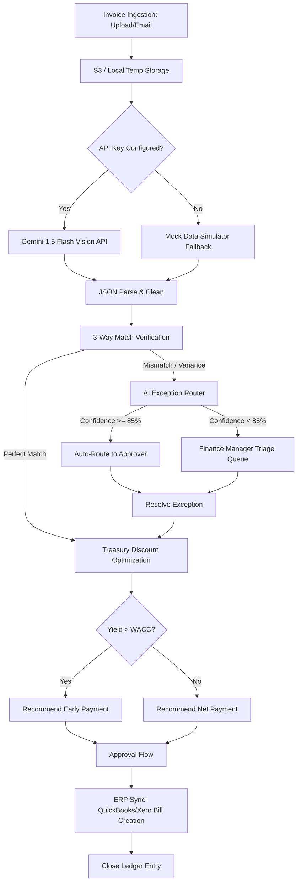

# VendorPulse Backend Workflow Specification

This document details the backend processing pipeline, execution flow, AI-powered extraction, matching engine logic, database operations, and treasury optimization algorithms implemented in the **VendorPulse** backend.

---

## 1. Execution Flow & Architecture Overview

The backend workflow of VendorPulse orchestrates ingestion, intelligent document extraction, 3-way ledger matching, exception routing, capital optimization, and ERP synchronization. The pilot backend implementation is housed in [backend/app.py](file:///D:/VendorPulse/backend/app.py) using Streamlit, with integrations targeting FastAPI, PostgreSQL, Celery, and Redis for the production environment.



---

## 2. Ingestion & Document AI Vision Extraction

The backend accepts invoices in PDF, PNG, JPG, or JPEG format.

### 2.1 Live Extraction Flow (Gemini 1.5 Flash)
If a `GEMINI_API_KEY` is present, the backend initializes the Google GenAI Client:
```python
client = genai.Client()
```
The file bytes and a strict extraction prompt are sent to `gemini-1.5-flash`:
* **System Role**: Expert accounts payable auditing system.
* **Goal**: Analyze the invoice image and output a clean JSON object conforming to the target schema.
* **Schema Fields**:
  - `vendor_name`: Vendor or sender name.
  - `invoice_number`: Invoice ID number.
  - `invoice_amount`: Total bill value as a float.
  - `purchase_order_number`: Referenced PO number (or `'N/A'`).
  - `payment_terms`: Extracted terms (e.g. `'2/10 Net 30'`, default `'Net 30'`).
  - `early_payment_discount_percentage`: Percentage discount for early payment (expressed as decimal, e.g. `0.02` for 2%).
  - `discount_period_days`: Number of days to qualify for the discount.
  - `net_period_days`: Net due date days.

### 2.2 Fallback Simulator Mode
If the API key is missing or the GenAI service raises an exception, the backend gracefully falls back to a realistic mock baseline:
```python
MOCK_INVOICE_DATA = {
    "vendor_name": "Acme Industrial Supplies Ltd.",
    "invoice_number": "INV-2026-8942",
    "invoice_amount": 755.00,
    "purchase_order_number": "PO-99541",
    "payment_terms": "2/10 Net 30",
    "early_payment_discount_percentage": 0.20,
    "discount_period_days": 10,
    "net_period_days": 30
}
```

---

## 3. 3-Way Match Verification Engine

Once the invoice data is parsed, the backend cross-references it with local database records:
1. **Purchase Order (PO)**: Validates if the `purchase_order_number` exists and matches the total value/items.
2. **Goods Receipt (GR)**: Validates if goods have been marked as received.

### Matching Rules & Tolerances
| Exception Type | Trigger Metric | Tolerance Threshold | Action |
| :--- | :--- | :--- | :--- |
| **`PRICE_VARIANCE`** | Invoice unit price vs PO unit price | **0% tolerance** | Raises Exception |
| **`QUANTITY_VARIANCE`** | Invoice quantity vs GR quantity received | **+0% / -5% variance** | Raises Exception |
| **`TOTAL_VARIANCE`** | Invoice total vs PO total | **±0.5% (max $10)** | Raises Exception |
| **`MISSING_PO`** | Invoice PO field not found in DB | **No matching record** | Raises Exception |

If any variance is triggered, the invoice status changes to `EXCEPTION` and it is sent to the Exception Router. Otherwise, status becomes `MATCHED`.

---

## 4. AI Exception Router

Exceptions are routed based on historical patterns to reduce manual triage bottlenecks.

1. **Feature Extraction**: Constructs a feature vector from `[vendor_id, amount, variance_amount, exception_type, department]`.
2. **AI Classifier Model**: Celery workers run the model (XGBoost/LLM few-shot prompt) to compute routing probabilities.
3. **Routing Decision**:
   - **Confidence $\ge 85\%$**: Auto-assigns the exception to the predicted approver and triggers a SendGrid notification.
   - **Confidence $< 85\%$**: Assigns status `OPEN` with a null assignee, sending it to the manual Finance Manager queue.
4. **Reinforcement Loop**: When a manager manually resolves an exception (`PAY_OVERRIDE`, `REQUEST_REVISED_INVOICE`, `WRITE_OFF_VARIANCE`), the transaction telemetry is saved to `exception_routing_history` for model retraining.

---

## 5. Early Payment Discount Optimizer

To optimize capital allocation, the backend evaluates payment terms dynamically.

### 5.1 Mathematics of Yield Optimization
To calculate whether early payment is more capital efficient than keeping the cash, the system computes the **Implied Annualized Yield ($APR_{implied}$)**:

$$APR_{implied} = \frac{d}{1 - d} \times \frac{365}{t_{net} - t_{early}}$$

Where:
- $d$ = `early_payment_discount_percentage`
- $t_{early}$ = `discount_period_days`
- $t_{net}$ = `net_period_days`
- $t_{net} - t_{early}$ = Days saved by paying early.

### 5.2 Decision Algorithm
```python
days_saved = net_period_days - discount_period_days
if days_saved > 0 and d_pct > 0:
    implied_annual_yield = (d_pct / (1 - d_pct)) * (365 / days_saved)
    cash_savings = invoice_amount * d_pct
else:
    implied_annual_yield = 0.0
    cash_savings = 0.0

if implied_annual_yield > cost_of_capital:
    # Verify liquidity limits in production
    if current_cash_balance - invoice_amount >= minimum_liquidity_threshold:
        recommendation = "APPROVE FOR IMMEDIATE PAYMENT (PAY EARLY)"
        eva_added = cash_savings
    else:
        recommendation = "HOLD FOR LIQUIDITY PRESERVATION"
else:
    recommendation = "HOLD PAYMENT UNTIL DUE DATE (PAY NET)"
```

---

## 6. Database Schema Integrations

During API processing, the backend interacts with the PostgreSQL DB through the following key tables:
* **`organizations`**: Fetches the tenant's `cost_of_capital` (cost of capital slider in the pilot) and `base_currency`.
* **`invoices`**: Updates status (`PENDING_MATCH`, `MATCHED`, `EXCEPTION`, `IN_APPROVAL`, `APPROVED`, `PAID`, `REJECTED`) and writes `ocr_raw_json`.
* **`exceptions`**: Registers detected matching variances.
* **`exception_routing_history`**: Logs manual resolutions to feed the weekly model retraining task.
* **`approval_history`**: Logs approval trails.

---

## 7. ERP Ledger Synchronization (QuickBooks/Xero)

On final approval:
1. **Webhook Trigger**: Dispatches payload to external ERP adapter.
2. **Bill Creation**: Re-creates invoice line-items in the ERP ledger as a `Bill` record.
3. **Payment Sync**: Monitors payment settlement in QuickBooks and closes the invoice record in VendorPulse (`PAID` status).
