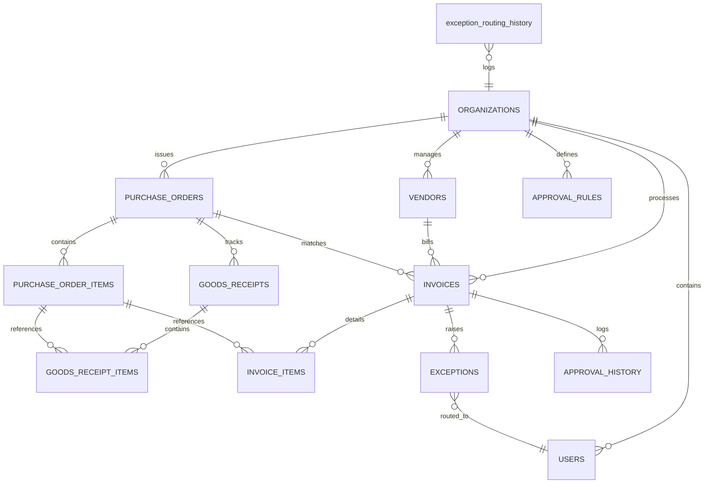

# VendorPulse Database Workflow Specification

This document details the exact workflow, transactional query pipelines, state-machine transitions, schema relationships, and indexing strategies utilized by the **VendorPulse** PostgreSQL database.

---

## 1. Relational Schema & Multi-Tenancy Architecture

The database is built on a shared-database, shared-schema multi-tenant architecture. Every tenant is represented as an `organization` linked directly to a Clerk Organization ID.

### Entity Relationship Diagram (ERD)



---

## 2. DDL & Data Types Specification

The database structures tables to ensure cascade deletes, UUID primary keys, default timestamps, and JSONB fields for AI metadata storage.

### 2.1 Schema Definitions
* **`organizations`**: Houses tenant configuration such as currency and opportunity Cost of Capital ($WACC$).
* **`users`**: User identity records bound to `organization_id` and Clerk User IDs.
* **`vendors`**: Vendor records containing payment term properties (`payment_terms`, `default_discount_pct`, `discount_days`, `net_days`) and bank accounts.
* **`purchase_orders` / `goods_receipts`**: ERP mirror tables representing open orders and corresponding deliveries.
* **`purchase_order_items`**: Contains itemized line details of a Purchase Order, including quantity, unit price, and total price.
* **`goods_receipt_items`**: Tracks received quantities mapped directly to specific PO lines.
* **`invoices`**: The central operational entity. Holds `ocr_raw_json` using PostgreSQL `JSONB` for deep querying of LLM-extracted metadata.
* **`invoice_items`**: Details individual extracted line items from the invoice, linking back to the `purchase_order_items` table to support granular 3-way matches.
* **`exceptions`**: Tracks discrepancies detected during the 3-Way Match (e.g. `PRICE_VARIANCE`, `QUANTITY_VARIANCE`, `MISSING_GR`, `UNKNOWN_VENDOR`).
* **`approval_rules` / `approval_history`**: Holds standard dynamic threshold routing rules and audit trails.
* **`exception_routing_history`**: A history table capturing exception resolution telemetry for training the XGBoost/few-shot AI router.

---

## 3. Database State Transition Workflow

The following sections walk through the database operations triggered during each phase of an invoice lifecycle.

### 3.1 Step 1: Document Ingestion (Draft Creation)
When a PDF/image is uploaded or received via email, a record is created in `invoices` with `PENDING_MATCH` status.
```sql
INSERT INTO invoices (
    organization_id, 
    vendor_id, 
    invoice_number, 
    amount, 
    tax_amount, 
    issue_date, 
    due_date, 
    payment_terms, 
    file_url, 
    ocr_raw_json, 
    status
) VALUES (
    :org_id, 
    :vendor_id, 
    :invoice_num, 
    :amount, 
    :tax, 
    :issue_date, 
    :due_date, 
    :terms, 
    :file_url, 
    :raw_jsonb, -- Store raw LLM response
    'PENDING_MATCH'
) RETURNING id;
```

---

### 3.2 Step 2: 3-Way Match Audit Pipeline
The backend runs queries to match the invoice against Purchase Orders and Goods Receipts:
```sql
-- 1. Fetch matching PO
SELECT * FROM purchase_orders 
WHERE organization_id = :org_id 
  AND po_number = :po_number;

-- 2. Fetch goods receipts associated with PO
SELECT * FROM goods_receipts 
WHERE organization_id = :org_id 
  AND purchase_order_id = :po_id;
```

#### Scenario A: Perfect Match (Transition to Approval Flow)
If the pricing and quantity align within tolerance limits:
```sql
UPDATE invoices 
SET status = 'IN_APPROVAL', 
    matching_result = 'THREE_WAY_OK',
    updated_at = CURRENT_TIMESTAMP
WHERE id = :invoice_id;
```

#### Scenario B: Variance Found (Raise Exception)
If a discrepancy exceeds tolerances (e.g. quantity variance):
```sql
-- 1. Update Invoice Status
UPDATE invoices 
SET status = 'EXCEPTION', 
    matching_result = 'QTY_MISMATCH',
    updated_at = CURRENT_TIMESTAMP
WHERE id = :invoice_id;

-- 2. Insert Exception Record
INSERT INTO exceptions (
    invoice_id, 
    exception_type, 
    description, 
    confidence_score, 
    predicted_approver_id, 
    assigned_approver_id, 
    status
) VALUES (
    :invoice_id, 
    'QUANTITY_VARIANCE', 
    'Invoice quantity exceeds Goods Receipt quantity.', 
    :ai_confidence, 
    :predicted_approver_id, 
    :assigned_approver_id, -- Populated if confidence >= 85%
    'OPEN'
);
```

---

### 3.3 Step 3: Exception Resolution & ML Telemetry
When an exception is resolved by a Finance Manager or assigned user:
```sql
-- 1. Update Exception status
UPDATE exceptions 
SET status = 'RESOLVED',
    resolved_by_id = :user_id,
    resolution_notes = :notes,
    resolved_at = CURRENT_TIMESTAMP
WHERE id = :exception_id;

-- 2. Log feedback telemetry for model retraining
INSERT INTO exception_routing_history (
    organization_id, 
    exception_type, 
    vendor_id, 
    amount, 
    variance_amount, 
    department, 
    final_approver_id
) VALUES (
    :org_id, 
    :exception_type, 
    :vendor_id, 
    :amount, 
    :variance, 
    :department, 
    :user_id -- Logs who ended up resolving the issue
);

-- 3. Release Invoice to Approval Flow
UPDATE invoices 
SET status = 'IN_APPROVAL',
    updated_at = CURRENT_TIMESTAMP
WHERE id = :invoice_id;
```

---

### 3.4 Step 4: Dynamic Approval Chain Evaluation
The system evaluates dynamic approval rules based on the department and dollar thresholds:
```sql
-- Fetch active rules sorting by min_amount descending
SELECT approver_id 
FROM approval_rules 
WHERE organization_id = :org_id 
  AND (department = :dept OR department IS NULL)
  AND :invoice_amount >= min_amount 
  AND (:invoice_amount <= max_amount OR max_amount IS NULL)
  AND is_active = TRUE
ORDER BY min_amount DESC;
```
For each approver action, a transaction writes to `approval_history`:
```sql
INSERT INTO approval_history (
    invoice_id, 
    approver_id, 
    action, 
    comments
) VALUES (
    :invoice_id, 
    :approver_id, 
    :action_taken, -- 'APPROVED' or 'REJECTED'
    :comments
);
```
* **If all approvals clear**: The invoice is updated to `APPROVED`.
* **If any approver rejects**: The invoice is updated to `REJECTED`.

---

### 3.5 Step 5: Capital Optimization & Payment Settlement
Before payments are scheduled, the cash flow forecasts are optimized. When payment settles (via QuickBooks Online webhook or sync):
```sql
UPDATE invoices 
SET status = 'PAID',
    early_payment_status = :opt_status, -- 'OPTIMAL_PAID_EARLY' or 'OPTIMAL_PAID_NET'
    updated_at = CURRENT_TIMESTAMP
WHERE id = :invoice_id;
```

---

## 4. Query & Index Performance Optimization

To ensure strict tenant isolation and high throughput on large datasets, the following indexing strategies are applied:

### 4.1 Indexing Foreign Keys (Multi-Tenancy & Join Performance)
Every table has a foreign key to `organizations(id)` or its parent entity. To speed up tenant separation and join queries, indexes are placed on these keys:
```sql
CREATE INDEX idx_users_org ON users(organization_id);
CREATE INDEX idx_vendors_org ON vendors(organization_id);
CREATE INDEX idx_pos_org ON purchase_orders(organization_id);
CREATE INDEX idx_invoices_org ON invoices(organization_id);

-- Indexes for Item Tables to optimize join operations
CREATE INDEX idx_po_items_po_id ON purchase_order_items(purchase_order_id);
CREATE INDEX idx_gr_items_gr_id ON goods_receipt_items(goods_receipt_id);
CREATE INDEX idx_gr_items_po_item_id ON goods_receipt_items(purchase_order_item_id);
CREATE INDEX idx_invoice_items_invoice_id ON invoice_items(invoice_id);
CREATE INDEX idx_invoice_items_po_item_id ON invoice_items(purchase_order_item_id);
```

### 4.2 GIN Index on Invoice OCR Metadata (`JSONB`)
The AIvision parser stores raw invoice metadata in the `ocr_raw_json` column. A Generalized Inverted Index (GIN) allows the system to query deeply nested attributes within the JSON block:
```sql
CREATE INDEX idx_invoices_ocr_raw_gin ON invoices USING gin (ocr_raw_json);
```
*This index enables rapid queries searching for specific unstructured keys extracted by Gemini, such as finding all invoices containing a specific tax identifier or bank account routing number inside the JSON payload.*

### 4.3 Unique Constraints & Indexing for Identifiers
To prevent duplicate uploads and speed up lookups:
```sql
CREATE UNIQUE INDEX idx_invoices_num_vendor ON invoices(organization_id, vendor_id, invoice_number);
CREATE INDEX idx_exceptions_status ON exceptions(status, assigned_approver_id);
```
