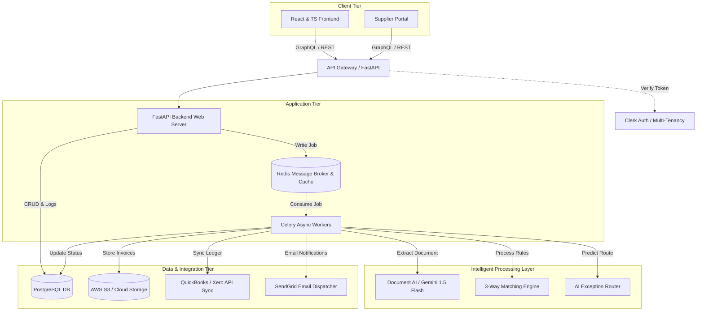
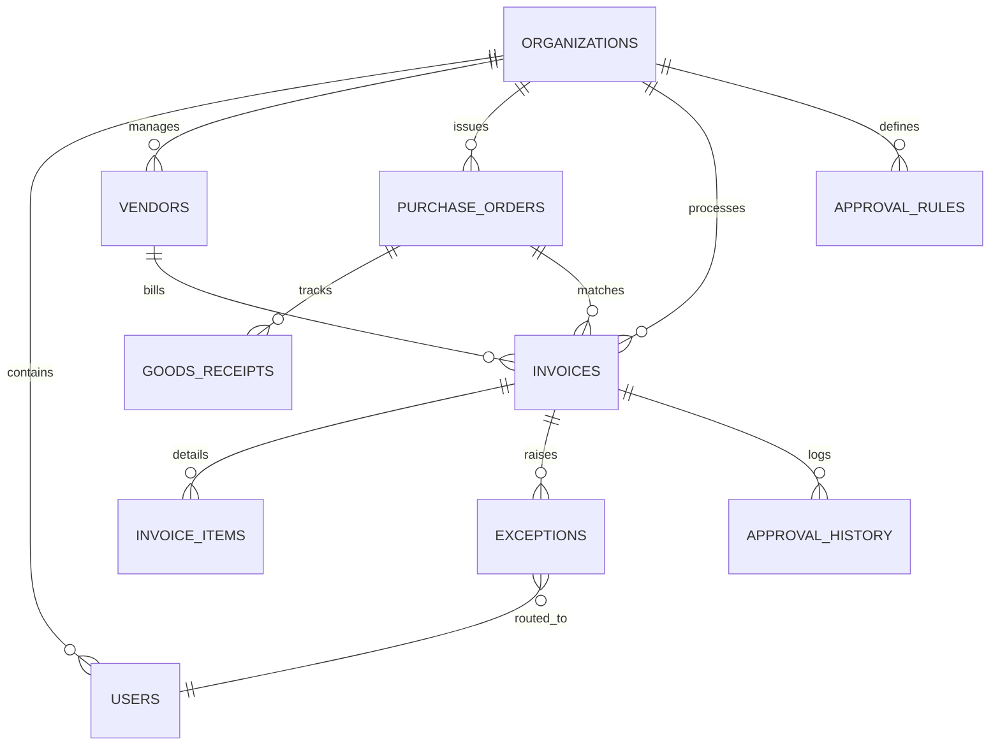

# System Architecture Specification

This document details the software, database, and system architecture for **VendorPulse**, an AI-powered Accounts Payable (AP) automation platform designed for mid-market companies.

---

## 1. High-Level System Topology

VendorPulse uses a decoupled, event-driven architecture to handle heavy OCR processing, AI matching, and integrations without blocking the user interface.



---

## 2. Database Schema (PostgreSQL)

The database schema is designed for multi-tenancy at its core. Every primary resource belongs to an `organization`, which maps to a Clerk Organization ID.

### Schema Entity Relationship Diagram (Conceptual)



### Table Definitions (DDL Concept)

#### 2.1 Tenant Administration
```sql
CREATE TABLE organizations (
    id UUID PRIMARY KEY DEFAULT gen_random_uuid(),
    clerk_org_id VARCHAR(255) UNIQUE NOT NULL,
    name VARCHAR(255) NOT NULL,
    cost_of_capital DECIMAL(5,2) DEFAULT 6.00, -- Company's annual opportunity cost (e.g. 6.00%)
    base_currency VARCHAR(3) DEFAULT 'USD',
    created_at TIMESTAMP WITH TIME ZONE DEFAULT CURRENT_TIMESTAMP,
    updated_at TIMESTAMP WITH TIME ZONE DEFAULT CURRENT_TIMESTAMP
);

CREATE TABLE users (
    id UUID PRIMARY KEY DEFAULT gen_random_uuid(),
    clerk_user_id VARCHAR(255) UNIQUE NOT NULL,
    organization_id UUID REFERENCES organizations(id) ON DELETE CASCADE,
    email VARCHAR(255) NOT NULL,
    first_name VARCHAR(100),
    last_name VARCHAR(100),
    role VARCHAR(50) NOT NULL, -- 'ADMIN', 'FINANCE_MANAGER', 'APPROVER', 'SUPPLIER_USER'
    created_at TIMESTAMP WITH TIME ZONE DEFAULT CURRENT_TIMESTAMP
);
```

#### 2.2 Core Financial Ledger Entities
```sql
CREATE TABLE vendors (
    id UUID PRIMARY KEY DEFAULT gen_random_uuid(),
    organization_id UUID REFERENCES organizations(id) ON DELETE CASCADE,
    name VARCHAR(255) NOT NULL,
    email VARCHAR(255) NOT NULL,
    payment_terms VARCHAR(100) DEFAULT 'Net 30', -- e.g., '2/10 Net 30'
    default_discount_pct DECIMAL(5,4) DEFAULT 0.0000, -- e.g., 0.0200 for 2%
    discount_days INT DEFAULT 0,
    net_days INT DEFAULT 30,
    bank_name VARCHAR(255),
    bank_routing_number VARCHAR(100),
    bank_account_number VARCHAR(100),
    status VARCHAR(50) DEFAULT 'ACTIVE', -- 'ACTIVE', 'PENDING_VERIFICATION', 'SUSPENDED'
    created_at TIMESTAMP WITH TIME ZONE DEFAULT CURRENT_TIMESTAMP
);

CREATE TABLE purchase_orders (
    id UUID PRIMARY KEY DEFAULT gen_random_uuid(),
    organization_id UUID REFERENCES organizations(id) ON DELETE CASCADE,
    vendor_id UUID REFERENCES vendors(id),
    po_number VARCHAR(100) UNIQUE NOT NULL,
    issue_date DATE NOT NULL,
    total_amount DECIMAL(15,2) NOT NULL,
    department VARCHAR(100) NOT NULL,
    status VARCHAR(50) DEFAULT 'OPEN', -- 'OPEN', 'PARTIALLY_FILLED', 'CLOSED'
    created_at TIMESTAMP WITH TIME ZONE DEFAULT CURRENT_TIMESTAMP
);

CREATE TABLE goods_receipts (
    id UUID PRIMARY KEY DEFAULT gen_random_uuid(),
    organization_id UUID REFERENCES organizations(id) ON DELETE CASCADE,
    purchase_order_id UUID REFERENCES purchase_orders(id),
    receipt_number VARCHAR(100) NOT NULL,
    received_date DATE NOT NULL,
    status VARCHAR(50) DEFAULT 'RECEIVED',
    created_at TIMESTAMP WITH TIME ZONE DEFAULT CURRENT_TIMESTAMP
);
```

#### 2.3 Invoice Management & Analytics
```sql
CREATE TABLE invoices (
    id UUID PRIMARY KEY DEFAULT gen_random_uuid(),
    organization_id UUID REFERENCES organizations(id) ON DELETE CASCADE,
    vendor_id UUID REFERENCES vendors(id),
    purchase_order_id UUID REFERENCES purchase_orders(id) ON DELETE SET NULL,
    invoice_number VARCHAR(100) NOT NULL,
    amount DECIMAL(15,2) NOT NULL,
    tax_amount DECIMAL(15,2) DEFAULT 0.00,
    issue_date DATE NOT NULL,
    due_date DATE NOT NULL,
    payment_terms VARCHAR(100) DEFAULT 'Net 30',
    file_url VARCHAR(512),
    ocr_raw_json JSONB,
    status VARCHAR(50) DEFAULT 'PENDING_MATCH', -- 'PENDING_MATCH', 'MATCHED', 'EXCEPTION', 'IN_APPROVAL', 'APPROVED', 'PAID', 'REJECTED'
    matching_result VARCHAR(50), -- 'THREE_WAY_OK', 'PRICE_MISMATCH', 'QTY_MISMATCH', 'NO_PO_FOUND'
    early_payment_status VARCHAR(50) DEFAULT 'CALCULATED', -- 'CALCULATED', 'OPTIMAL_PAID_EARLY', 'OPTIMAL_PAID_NET', 'SKIPPED'
    created_at TIMESTAMP WITH TIME ZONE DEFAULT CURRENT_TIMESTAMP,
    updated_at TIMESTAMP WITH TIME ZONE DEFAULT CURRENT_TIMESTAMP
);

CREATE TABLE exceptions (
    id UUID PRIMARY KEY DEFAULT gen_random_uuid(),
    invoice_id UUID REFERENCES invoices(id) ON DELETE CASCADE,
    exception_type VARCHAR(100) NOT NULL, -- 'PRICE_VARIANCE', 'QUANTITY_VARIANCE', 'MISSING_GR', 'UNKNOWN_VENDOR'
    description TEXT,
    confidence_score DECIMAL(5,2), -- AI prediction route confidence (0-100%)
    predicted_approver_id UUID REFERENCES users(id),
    assigned_approver_id UUID REFERENCES users(id),
    status VARCHAR(50) DEFAULT 'OPEN', -- 'OPEN', 'RESOLVED', 'FORWARDED'
    resolved_by_id UUID REFERENCES users(id),
    resolution_notes TEXT,
    created_at TIMESTAMP WITH TIME ZONE DEFAULT CURRENT_TIMESTAMP,
    resolved_at TIMESTAMP WITH TIME ZONE
);
```

#### 2.4 Workflow Routing & Machine Learning Feedback
```sql
CREATE TABLE approval_rules (
    id UUID PRIMARY KEY DEFAULT gen_random_uuid(),
    organization_id UUID REFERENCES organizations(id) ON DELETE CASCADE,
    department VARCHAR(100),
    min_amount DECIMAL(15,2) DEFAULT 0.00,
    max_amount DECIMAL(15,2),
    approver_id UUID REFERENCES users(id) NOT NULL,
    is_active BOOLEAN DEFAULT TRUE,
    created_at TIMESTAMP WITH TIME ZONE DEFAULT CURRENT_TIMESTAMP
);

CREATE TABLE approval_history (
    id UUID PRIMARY KEY DEFAULT gen_random_uuid(),
    invoice_id UUID REFERENCES invoices(id) ON DELETE CASCADE,
    approver_id UUID REFERENCES users(id) NOT NULL,
    action VARCHAR(50) NOT NULL, -- 'APPROVED', 'REJECTED', 'REROUTED'
    comments TEXT,
    created_at TIMESTAMP WITH TIME ZONE DEFAULT CURRENT_TIMESTAMP
);

-- Historical resolution ledger to train and tune the AI Exception Router
CREATE TABLE exception_routing_history (
    id UUID PRIMARY KEY DEFAULT gen_random_uuid(),
    organization_id UUID REFERENCES organizations(id) ON DELETE CASCADE,
    exception_type VARCHAR(100) NOT NULL,
    vendor_id UUID REFERENCES vendors(id),
    amount DECIMAL(15,2) NOT NULL,
    variance_amount DECIMAL(15,2) DEFAULT 0.00,
    department VARCHAR(100),
    final_approver_id UUID REFERENCES users(id),
    created_at TIMESTAMP WITH TIME ZONE DEFAULT CURRENT_TIMESTAMP
);
```

---

## 3. Core Engine Components

### 3.1 AI-Powered Exception Router (The Innovation Angle)
When the 3-Way Match Engine detects a mismatch (e.g., invoice price exceeds PO price by 5%), an exception is raised. 

1. **Features Extracted**:
   - `vendor_id`, `amount`, `mismatch_ratio`, `department`, `exception_type`.
2. **AI Model Pipeline**:
   - Runs a Celery job referencing an XGBoost Classifier or a specialized Few-Shot LLM Prompt containing historical routing decisions for the organization.
   - Computes probability weights for each possible internal approver.
3. **Route Allocation**:
   - If confidence $C \ge 85\%$: Automatically assigns `assigned_approver_id = predicted_approver_id` and fires an notification.
   - If confidence $C < 85\%$: Flags as "Ambiguous Route" and sends it to the central Finance Manager queue for manual triage.
4. **Reinforcement Loop**:
   - When a manual triage resolves the exception, the system records it in `exception_routing_history`, feeding back into the weekly retraining loop of the routing model.

### 3.2 Early Payment Discount Optimizer
To maximize cash returns, the system calculates the **Implied Annualized Yield ($APR_{implied}$)** of the vendor discount against the organization's **Opportunity Cost of Capital ($WACC$)**.

$$APR_{implied} = \frac{\text{Discount \%}}{1 - \text{Discount \%}} \times \frac{365}{\text{Net Days} - \text{Discount Days}}$$

#### Optimization Algorithm:
```
If (APR_implied > organization.cost_of_capital):
    If (current_cash_balance - invoice.amount >= minimum_liquidity_threshold):
        Set recommendation = "PAY_EARLY"
        Calculate savings = invoice.amount * discount_pct
    Else:
        Set recommendation = "HOLD_FOR_LIQUIDITY_PRESERVATION"
Else:
    Set recommendation = "PAY_ON_DUE_DATE"
```

---

## 4. API Endpoints (FastAPI)

Below are the primary core API contracts for system interaction.

### 4.1 Ingestion & Matching
* `POST /api/v1/invoices/upload`
  * Uploads a PDF/Image, triggers S3 upload, and queues Celery job `process_ocr_and_match`.
* `GET /api/v1/invoices/{id}/matching`
  * Returns line-by-line mismatch data between Invoice, PO, and Goods Receipt.

### 4.2 Exceptions & AI Routing
* `GET /api/v1/exceptions/pending`
  * Fetches exceptions matching the authenticated user's role or assigned ID.
* `POST /api/v1/exceptions/{id}/resolve`
  * Manually resolves the exception, routes it to an approver, and records telemetry for AI routing reinforcement.

### 4.3 Capital Optimization
* `GET /api/v1/treasury/discount-matrix`
  * Returns list of all pending invoices, sorted by highest Implied Yield to support treasury payout runs.
* `GET /api/v1/analytics/cashflow`
  * Generates cash requirements forecast grouped by weeks (Day 10 vs Day 30 payments).

---

## 5. Integration Framework

1. **ERP / GL Sync (QuickBooks Online / Xero)**:
   - Webhook triggered on "Invoice Approved".
   - Pushes invoice transaction line items to QuickBooks as a `Bill` record.
   - Reconciles paid records weekly from QuickBooks bank account feeds.
2. **Supplier Portal Authentication**:
   - Clerk handles token exchange using separate organization roles.
   - Suppliers can view only invoices mapped to their corresponding `vendor_id`.


