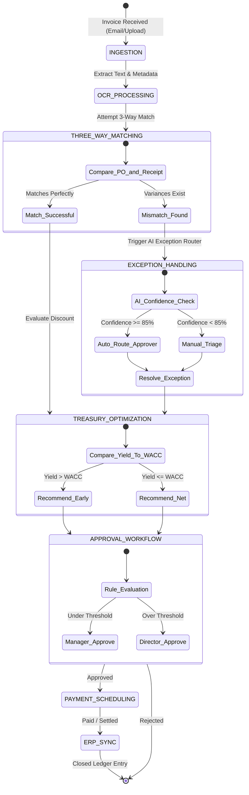
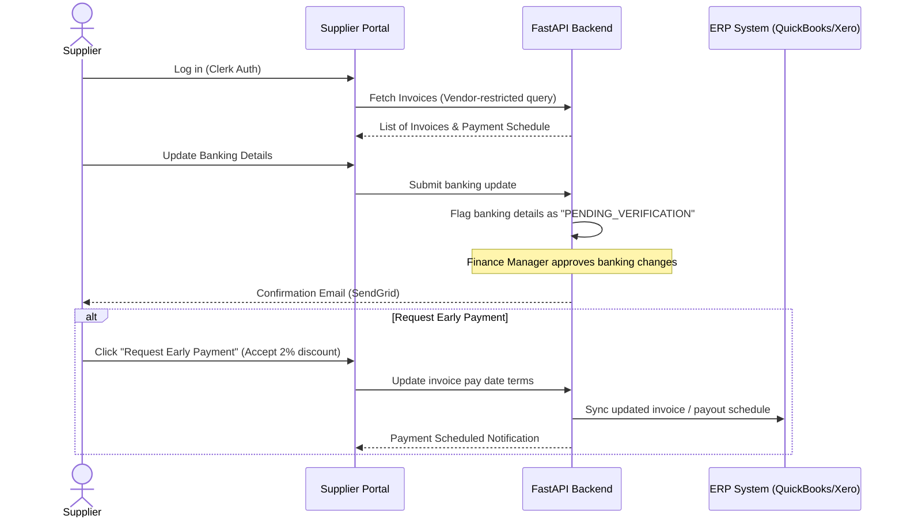

# Operational Workflow & Lifecycle Specification

This document details the step-by-step operational workflows, state machines, and lifecycles implemented in the **VendorPulse** AP automation platform.

---

## 1. End-to-End Invoice Processing Lifecycle

The lifecycle of an invoice spans from raw email arrival or portal upload, through AI matching and dynamic approvals, to final ERP ledger synchronization.



---

## 2. Ingestion and OCR Pipeline Workflow

Invoices enter the system via two channels:
1. **Email Ingestion**: A dedicated address (e.g., `invoices@company.vendorpulse.co`) receives vendor bills.
2. **Direct Upload**: Finance managers drag-and-drop PDF, PNG, or JPEG files.

### Workflow steps:
1. **File Landing**: Invoices are stored securely in an AWS S3 bucket.
2. **OCR Parsing**: FastAPI triggers an async Celery worker calling Google Document AI / Gemini 1.5 Flash.
3. **Structured Normalization**: The AI parses:
   - Vendor details (Name, Address, Tax ID, Bank Details)
   - Invoice Header metadata (Invoice ID, Invoice Date, Due Date, Terms)
   - Line items (Description, Quantity, Unit Price, Line Total)
   - Total Amount, Subtotal, and Tax Amount
4. **Validation Check**: If the system fails to extract basic details (e.g., missing invoice amount), the status shifts to `DRAFT_INGESTION_ERROR` and requests manual vendor review.

---

## 3. The AI 3-Way Matching Engine Rules

The system matches the newly extracted **Invoice** data against the corresponding **Purchase Order (PO)** and **Goods Receipt (GR)**.

| Metric | Matching Target | Tolerance Level | Mismatch Event |
| :--- | :--- | :--- | :--- |
| **Unit Price** | Invoice Line vs PO Line | **0% tolerance** | `PRICE_VARIANCE` |
| **Line Quantity** | Invoice Qty vs Received Qty (GR) | **+0% / -5% variance** | `QUANTITY_VARIANCE` |
| **Total Amount** | Invoice Total vs PO Total | **±0.5% (max $10)** | `TOTAL_VARIANCE` |
| **PO Reference** | Invoice PO field vs DB record | **Exact Match** | `MISSING_PO` |

### Logic Decision Tree:
```
IF invoice.po_number IS NOT FOUND:
    Flag: MISSING_PO Exception
ELSE IF invoice.total_amount > purchase_order.total_amount + tolerance:
    Flag: PRICE_VARIANCE Exception
ELSE IF invoice_item.quantity > goods_receipt_item.quantity:
    Flag: QUANTITY_VARIANCE Exception
ELSE:
    Status: MATCHED (Proceed to optimization)
```

---

## 4. Smart Exception Handling & Routing Workflow

Exceptions bypass normal routes and are handled by the **AI Exception Router**.

### Step 1: AI Confidence Evaluation
The exception router runs a prediction pipeline based on historic routing logs.
```
Inputs: [Vendor ID, Invoice Total, Variance Amount, Exception Code, Requestor Department]
Output: Assigned User ID, Confidence Score (C)
```

### Step 2: Routing Paths
- **Path A ($C \ge 85\%$ - Auto-Route)**: The system auto-assigns the exception to the predicted stakeholder (e.g., a specific department head who approved the purchase order override in the past). Email sent via SendGrid.
- **Path B ($C < 85\%$ - Central Queue)**: The exception appears in the "Unassigned Exception Queue" where a Finance Administrator assigns it manually.

### Step 3: Resolution & RL Feedback Loop
Once the assignee clicks **Resolve**:
- They specify the resolution action: `PAY_OVERRIDE`, `REQUEST_REVISED_INVOICE`, or `WRITE_OFF_VARIANCE`.
- This resolution telemetry is captured and logged.
- The Celery scheduler schedules a training job to retrain the local organization classification model using the updated resolution dataset.

---

## 5. Early Payment Discount Optimization Workflow

This workflow calculates the capital efficiency of settling the invoice early to secure vendor-specified terms (e.g., `2/10 Net 30`).

### Step-by-Step Optimization Process:
1. **Extract Terms**: Identify if early payment terms exist. If yes: discount rate $d$ (e.g., $2\%$), discount day window $t_{early}$ (e.g., Day 10), and net days $t_{net}$ (e.g., Day 30).
2. **Calculate Yield**:
   $$APR_{implied} = \frac{d}{1 - d} \times \frac{365}{t_{net} - t_{early}}$$
3. **Fetch Treasury Cost**: Fetch the Organization's opportunity cost of capital ($WACC$) configured in the dashboard (default $6\%$).
4. **Liquidity Verification**:
   - Query current cash balance from synced ERP (QuickBooks/Xero API).
   - If projected cash on Day 10 is below the organization-defined safety threshold, bypass early payment to preserve liquidity.
5. **Set Recommendation**:
   - If $APR_{implied} > WACC$ and Cash is sufficient: Recommend Early Payment.
   - If $APR_{implied} \le WACC$: Recommend Net Payment (Day 30).

---

## 6. Supplier Portal Workflow

The Supplier Portal provides self-service features for vendors, reducing manual finance email volume.



---

## 7. Analytics & Forecasting Engine Calculations

The analytics panel uses real-time ledger records to calculate treasury metrics:

### 7.1 Days Payable Outstanding (DPO) Trend
DPO indicates the average time it takes a company to pay its invoices.
$$DPO = \frac{\text{Average Accounts Payable}}{\text{Cost of Goods Sold (COGS)}} \times 365$$
*VendorPulse simulates COGS or extracts it from QuickBooks integration, displaying DPO variations month-over-month to highlight how payment optimization is impacting corporate cash retention.*

### 7.2 Cash Flow Forecast Engine
- Combines approved invoices, due dates, early payment optimization flags, and purchase orders.
- Maps projected cash outflows over 30, 60, and 90-day intervals.
- Dynamically shifts payout dates based on recommendations (`Early Pay` vs `Net Pay`) to display cash balance variance.

### flowchart:

Supplier                    
   │
   ▼
Sends Invoice
   │
   ▼
Invoice Upload
   │
   ▼
OCR + AI Extraction
   │
   ▼
3-Way Matching
   │
   ▼
Match?
 │           │
Yes         No
 │           │
 ▼           ▼
Payment    AI Exception
Optimizer   Handler
 │           │
 └─────► Approval
             │
             ▼
        Payment
             │
             ▼
       ERP Update
             │
             ▼
        Invoice Closed


 ## overall authentication flow : 

   User Opens Website
        │
        ▼
React Application Starts
        │
        ▼
ClerkProvider Checks Session
        │
   ┌────┴────┐
   │         │
Logged In   Not Logged In
   │             │
   ▼             ▼
Dashboard     Login Page
                   │
                   ▼
        Continue with Google
                   │
                   ▼
           Google Authentication
                   │
                   ▼
         Clerk Creates JWT Session
                   │
                   ▼
          SSO Callback Completes
                   │
                   ▼
         ProtectedRoute Allows Access
                   │
                   ▼
Dashboard Requests Backend Data
                   │
                   ▼
      JWT Sent in Authorization Header
                   │
                   ▼
       FastAPI Verifies JWT (JWKS)
                   │
         ┌─────────┴─────────┐
         │                   │
     Invalid             Valid
         │                   │
         ▼                   ▼
401 Unauthorized      Load/Create User
                             │
                             ▼
              Query PostgreSQL Using organization_id
                             │
                             ▼
                  Return Organization Data