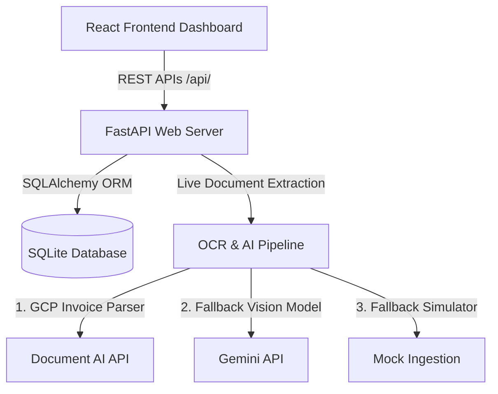

# VendorPulse Setup & Execution Guide

This comprehensive guide details the step-by-step instructions to install, configure, initialize, and execute the **VendorPulse** Accounts Payable (AP) automation and treasury capital optimizer platform.

---

## 1. System Architecture Overview

VendorPulse consists of four main architectural modules:



* **Frontend**: Built with React, Vite, Tailwind CSS, and Lucide icons. Serves a treasury analytics view, invoices manager, matching details screen, and an interactive supplier portal.
* **Backend**: FastAPI web server hosting REST APIs for data synchronization, 3-way matching validation, treasury discount matrix math, and manual exception resolutions.
* **Database**: Relational SQLite database (`vendorpulse.db`) mapped via SQLAlchemy ORM. Tracks organizations, users, vendors, purchase orders, goods receipts, invoices, line-item details, and approval history logs.
* **OCR & AI Engine**: A Google Document AI (Invoice Parser) and Gemini 1.5 Flash vision extraction pipeline that extracts invoice metadata. Runs in **Simulator Mode** automatically if credentials are not configured.

---

## 2. Prerequisites

Ensure your machine has the following software installed:
* **Node.js**: Version 18.0 or higher.
* **Python**: Version 3.10 or higher.
* **NPM**: Package manager (comes bundled with Node.js).
* **Git**: Version control CLI.

---

## 3. Environment Configuration

1. In the root directory of the project, create or verify the existence of a file named `.env`:
   ```bash
   # Google Gemini API Key (Optional for fallback vision processing)
   GEMINI_API_KEY="your-gemini-api-key-here"

   # Google Cloud Platform credentials (Optional for live Document AI)
   GCP_PROJECT_ID="your-gcp-project-id"
   DOCUMENT_AI_PROCESSOR_ID="your-document-ai-processor-id"
   GCP_LOCATION="us"
   GOOGLE_APPLICATION_CREDENTIALS="C:/path/to/your/gcp-service-account.json"

   # Database Connection URL (Defaults to local SQLite)
   DATABASE_URL="sqlite:///vendorpulse.db"
   ```

   > [!NOTE]
   > If no API keys are provided in `.env`, VendorPulse runs in **Intelligent Simulator Mode**, which extracts and processes mock data without throwing errors or requiring internet requests.

---

## 4. Installation & Setup

Open your terminal (PowerShell, Command Prompt, or terminal shell) and execute the following installation prompts:

### Step A: Backend Installation
1. **Navigate to the root directory** and create a Python virtual environment:
   ```powershell
   # Windows (PowerShell)
   python -m venv .venv
   ```
2. **Activate the virtual environment**:
   ```powershell
   # Windows (PowerShell)
   .venv\Scripts\Activate.ps1

   # Windows (Command Prompt)
   .venv\Scripts\activate.bat

   # macOS / Linux
   source .venv/bin/activate
   ```
3. **Install python packages**:
   ```powershell
   pip install -r Backend/requirements.txt
   ```

### Step B: Database Initialization & Seeding
Ensure you are in the project root directory with your virtual environment active, and execute:
```powershell
python Backend/database.py
```
* **What this does**: Automatically compiles the relational schema tables, populates organization profiles (Acme Corp), default users (approvers & specialists), and seeds baseline purchase orders, goods receipts, and invoices.

### Step C: Frontend Installation
1. Open a new terminal window or tab, navigate to the `Frontend` folder, and install packages:
   ```powershell
   cd Frontend
   npm install
   ```

---

## 5. Execution Instructions (Running the Project)

You can launch both the frontend and backend applications using the automatic script or by running manual terminal prompts.

### Option 1: Automatic Startup (Windows Only)
In your file explorer or terminal, run the batch script:
```powershell
./run.bat
```
* This script automatically opens two separate command line windows to boot the FastAPI backend server on `http://127.0.0.1:8000` and the React Vite dev server on `http://localhost:5173`.

### Option 2: Manual Terminal Commands

| Application | Working Directory | Command Line Prompt | URL Address |
| :--- | :--- | :--- | :--- |
| **FastAPI Backend** | `/` (Project Root) | `python Backend/main.py` | `http://127.0.0.1:8000` |
| **Swagger OpenAPI** | `/` (Project Root) | *(Available when Backend is running)* | `http://127.0.0.1:8000/docs` |
| **React Frontend** | `/Frontend` | `npm run dev` | `http://localhost:5173` |
| **Streamlit Showcase** | `/` (Project Root) | `streamlit run Backend/app.py` | `http://localhost:8501` |

---

## 6. How to Test the Exception Workflows (Simulator Ingestion)

When running the React dashboard, go to the **Document Ingestion** tab. You can test the automated 3-Way Match Verification Engine and Exception Router by uploading a dummy file named with the following keywords:

1. **Perfect 3-Way Match**:
   * **Filename containing**: `acme` or `globex` (e.g., `acme_invoice.pdf`)
   * **Result**: Invoice matches completely against PO-99541, status maps to `MATCHED` or `APPROVED`, and treasury WACC analysis is triggered.
2. **Unit Price Discrepancy Exception**:
   * **Filename containing**: `initech` (e.g., `initech_bill.pdf`)
   * **Result**: Raises a `PRICE_VARIANCE` exception because the invoiced unit price exceeds PO-99543 unit prices.
3. **Missing Purchase Order Link Exception**:
   * **Filename containing**: `olivia` (e.g., `olivia_consulting.png`)
   * **Result**: Raises a `MISSING_PO` exception. The invoice is automatically flagged and sent to the AP Specialist triage queue.

---

## 7. Relevant Code Files

* [Backend/main.py](file:///D:/VendorPulse/Backend/main.py): Core FastAPI web server, routes, and matching logic.
* [Backend/database.py](file:///D:/VendorPulse/Backend/database.py): SQLite SQLAlchemy ORM schemas, database models, and seeding logic.
* [Backend/document_ai_ocr.py](file:///D:/VendorPulse/Backend/document_ai_ocr.py): Google Cloud Document AI processing client wrapper.
* [Frontend/src/App.tsx](file:///D:/VendorPulse/Frontend/src/App.tsx): Root React entrypoint that drives the dashboard views.
* [run.bat](file:///D:/VendorPulse/run.bat): Batch execution script for quick local startup.
